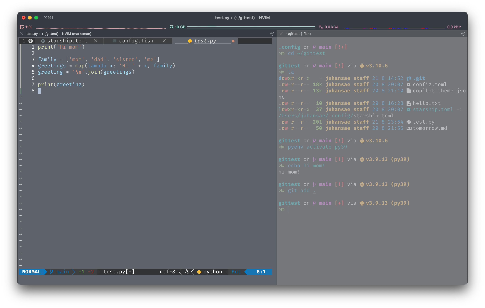

# Verssae's dotfiles
These are my dotfiles 😆


(I recommend to change Github to dark theme. It looks better !)
## Shell setup (macOS)
- [Fish Shell](https://github.com/fish-shell/fish-shell)
  - I use __fish__ instead of _zsh_.
  - `fish/config.fish`
- [Nerd Fonts](https://www.nerdfonts.com/)
  - I use __FiraCode__
- [Exa](https://github.com/ogham/exa)
  - A modern replacement for `ls`
- [starship](https://github.com/starship/starship) 
  - I customize starship theme based on `Nerd Font Symbols` preset
  - `starship.toml`
- [iterm2](https://iterm2.com/)
  - I use [OneHalfDark](https://github.com/mbadolato/iTerm2-Color-Schemes) colorscheme.

## NeoVim setup
My nvim setup is cloned from [craftzdog/dotfiles-public](https://github.com/craftzdog/dotfiles-public) (This repo is very cool, thanks ! 🙏🙏🙏)

The differences are:
- [vscode.nvim](https://github.com/Mofiqul/vscode.nvim)
  - This is a VSCode-like vim-code-dark color scheme. Very awesome !
- [NeoFormat](https://github.com/sbdchd/neoformat)
  - I use it instead of prettier for code formatting. It supports many LSPs.
- [copilot.vim](https://github.com/github/copilot.vim)
  - I'm a big fan of Copilot 👍
- [Other LSPs](https://github.com/neovim/nvim-lspconfig/blob/master/doc/server_configurations.md)...

## Quick Start (macOS)
### iterm2
Install iterm2, font and colorscheme:
```fish
brew install --cask iterm2
brew install --cask font-fira-code-nerd-font # FiraCode Nerd Font
git clone https://github.com/Verssae/dotfiles.git # onehalfdark.iterm-colors
```
Then open `iterm`, go `Preferences > Profile` and change colorscheme and font.

### Fish and NVim Install
Install Fish, exa, starship and noevim:
```fish
brew install fish exa starship neovim 
```

Then override their configurations to dotfiles:
```fish
cp -r dotfiles/ ~/.config/
rm -r ~/.config/nvim/*.vim # remove exist *.vim configs
rm -r ~/.config/nvim/after/plugin/*.rc.vim
```

### Install Plugins and Requirements
```fish
brew install tree-sitter
```

Then open `vim` and  install plugins with packer:
```
:PackerSync
```

### Download Language Servers 
- Python
```fish
npm i -g pyright
```
- Lua
```fish
brew install lua-language-server
```
- Typescript
```fish
npm i -g typescript-language-server
```
- [Markdown](https://github.com/artempyanykh/marksman)

## Additional: Python Virtual-env Setup 
I prefer `pyenv` instead of `conda`.
```fish
brew install pyenv pyenv-virtualenv
```

Then add below commands to your `~/.config/fish/config.fish` or `config-local.fish`:
```fish
pyenv init - | source
status --is-interactive; and pyenv virtualenv-init - | source
```

## To-do
- [x] Describe full setup process for quick install for macOS
- [ ] Support other OS platforms
- [ ] Add Usage (alias, plugins, etc)
